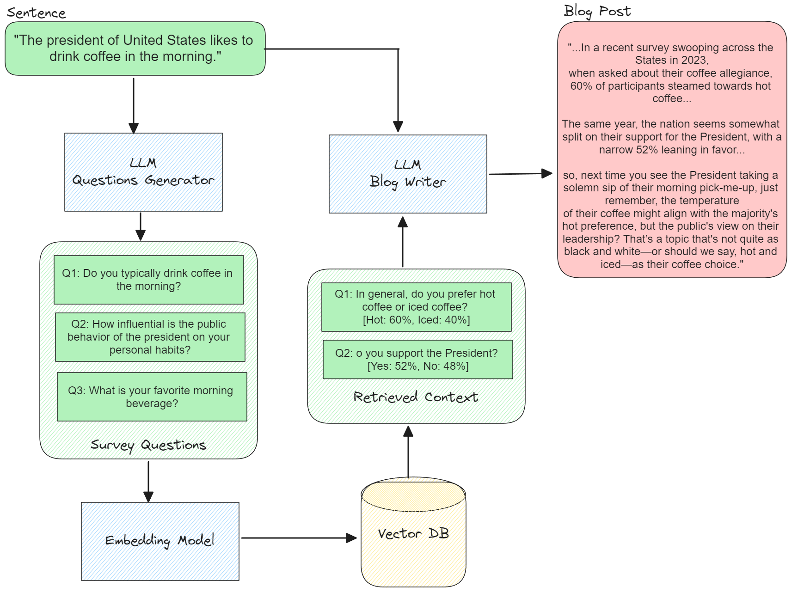

# survey-it [Proof of Concept]

Survey-it is a tool that extracts actionable insights from text and validates them with data derived from surveys. It crafts targeted questions and leverages a reference database alongside AI-generated synthetic response estimations to enrich understanding and support findings with empirical evidence.

## Installation

```
conda create --name survey-it -c conda-forge python=3.11
conda activate survey-it
pip install -r requirements.txt
```

## Example Notebook

[Proof of Concept](notebooks/00_poc.ipynb)

### Semantic Search over Survey Question DB


### Using a Causal Experiment Simulator
